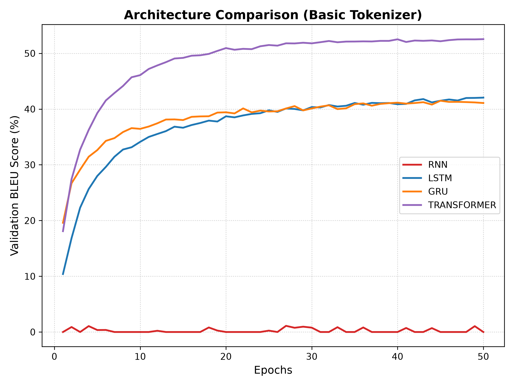
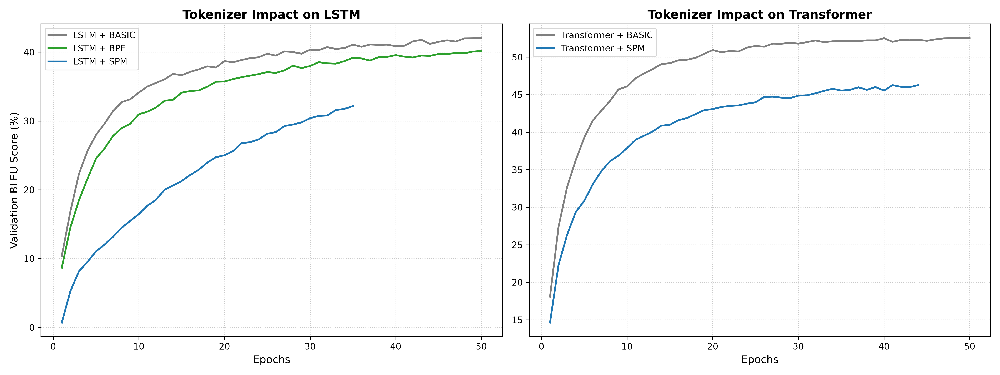
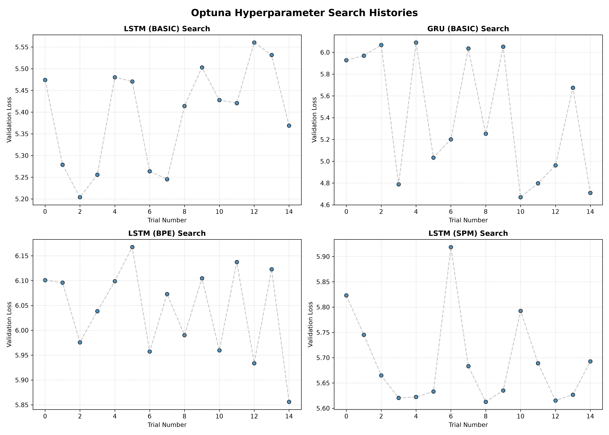
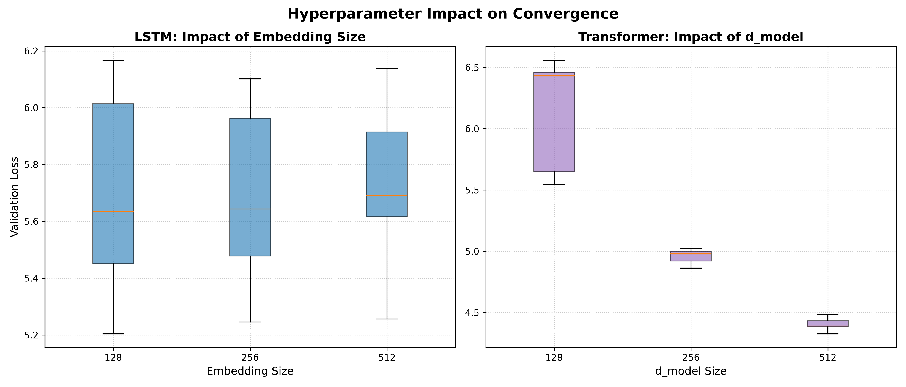

# Machine Translation in PyTorch

<div align="center">
  <p>
    
    
    
    
  </p>
</div>

This project is an end-to-end Neural Machine Translation (NMT) system built from scratch using PyTorch. It serves as a comparative study evaluating the performance, translation quality, and convergence characteristics of different neural architectures (Vanilla RNN, LSTM, GRU, and Transformer) and tokenization strategies (Word-level, custom Byte-Pair Encoding, and Google's SentencePiece) on the Tatoeba English-French dataset (~230k parallel sentence pairs).

<div align="center">
  
  
  <br>
  
  
</div>

## Features

- **Custom Tokenization Pipeline**: Implements three separate tokenization strategies to evaluate the out-of-vocabulary (OOV) problem:
  - A from-scratch basic word-level tokenizer with regex parsing for French accents (`r"[^a-zA-ZÀ-ÿ.!?]+"`).
  - A custom Byte-Pair Encoding (BPE) tokenizer built in pure Python.
  - A C++-optimized unigram tokenizer via `sentencepiece`.
- **Unified NMT Architectures**:
  - **Recurrent Models**: Consolidates Vanilla RNN, LSTM, and GRU cells into a single, modular Encoder-Decoder pipeline.
  - **Transformer**: Implements a full self-attention NMT model, including the scaling adjustment ($\sqrt{d_{model}}$) prior to positional encoding addition to prevent representation collapse.
- **Fault-Tolerant Training**: Checkpoints the model state, optimizer, metrics history, and early-stopping counters at the end of each epoch. The `--resume` flag automatically recovers the matching vocabulary dictionary from the run directory to prevent coordinate-shift weight corruption during preemption recovery.
- **Hyperparameter Optimization**: Integrates Optuna to search for optimal architectural boundaries (embedding dimensions, layer counts, feed-forward dimensions) while isolating standard training hyperparameters.

---

## Tech Stack

- **Machine Learning & Frameworks:** PyTorch, Torchmetrics (BLEU Score), Torchinfo, SentencePiece
- **Hyperparameter Optimization:** Optuna
- **Tracking & Visualizations:** TQDM, Matplotlib, JSON-based Metrics Logging

---

## Folder Structure

```text
translation/
├── dataset/
│   └── tatoeba/             # Downloaded parallel train and val splits
├── artifacts/               # Run subfolders storing vocab, checkpoints, logs, and params
├── docs/
│   └── figs/                # Generated comparative plots and metric charts
├── src/
│   ├── tokenizer.py         # BasicTokenizer, BPETokenizer, SPMTokenizer
│   ├── dataset.py           # Dataset class and optimized multiprocessing DataLoaders
│   ├── rnns.py              # Unified Recurrent models
│   ├── transformer.py       # Transformer model & Positional Encoding
│   ├── factory.py           # Model assembly logic
│   ├── trainer.py           # Epoch loops and run configurations
│   ├── optimize.py          # Optuna integration
│   ├── infer.py             # Autoregressive interactive translation
│   ├── tester.py            # Gradient & Forward pass checks
│   └── verify.py            # Dataloader & target slicing checks
├── main.py                  # CLI Entrypoint for ML Lifecycle (train/test/optimize/infer)
└── tools.py                 # CLI Entrypoint for Utilities (download/verify/plot)
```

---

## Getting Started

### Prerequisites
- Python 3.10+
- A CUDA-capable GPU

### Installation

1. **Clone the repository:**
```bash
git clone https://github.com/abderrahmenex86/translation.git
cd translation
virtualenv venv --python python3.12
source venv/bin/activate
pip install -r requirements.txt
```

2. **Download and prepare the Tatoeba dataset:**
```bash
python tools.py --mode download
```

3. **Verify dataloaders and target shifts:**
```bash
python tools.py --mode verify --tokenizer bpe --vocab_size 2000
```

---

## Workflow Guide

### 1. Sanity Checks
Verify memory layout, model output shapes, and backward gradient flow before committing to long training loops:
```bash
python main.py --mode test --model transformer --tokenizer spm
```

### 2. Architectural Hyperparameter Sweeps
Run an Optuna search to optimize model shapes (e.g., layers, embed dimension, hidden size) for a specific architecture. Results and trial histories are dumped to `artifacts/<run_dir>/optuna_summary.json`:
```bash
python main.py --mode optimize --model transformer --tokenizer spm
```

### 3. Model Training
Start a standard training run using optimized configurations. Training exits early if the validation loss fails to improve for the specified `--patience` threshold:
```bash
python main.py --mode train --model transformer --tokenizer spm --d_model 256 --dim_ff 1024 --num_enc 3 --num_dec 3 --epochs 50 --patience 7
```

### 4. Resuming Interrupted Runs
If a training session is interrupted, push your code or log back in and use the `--resume` flag. This automatically locates the latest folder in `artifacts/`, reloads the local vocabulary, and restores the optimizer states:
```bash
python main.py --mode train --model transformer --resume
```
*(Optionally, target a specific run using `--run_dir artifacts/<specific_folder>`)*

### 5. Interactive Inference
Test the model’s auto-regressive generation interactively via the terminal:
```bash
python main.py --mode infer --model transformer
```
